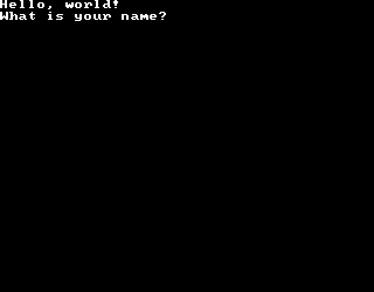
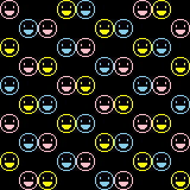

# Example

## Hello, world

```dart
import 'dart:html';
import 'package:old_school/old_school.dart';

main() async {
  final terminal = Terminal(
    rows: 25,
    columns: 40,
    container: document.getElementById("hello")!,
  );
  terminal.output("Hello, world!");
  final response = await terminal.input(
    prompt: "What is your name? ",
    length: 20,
  );
  terminal.output("Hello, $response!");
}
```



## Smile

```dart
import 'dart:html';
import 'package:old_school/old_school.dart';

main() async {
  final terminal = Terminal(
        rows: 20,
        columns: 20,
        container: document.getElementById("smile")!,
        rowGap: 0,
      ),
      smile = [ // In binary:
        0x07E0, // .....******.....
        0x1818, // ...**......**...
        0x2004, // ..*..........*..
        0x4002, // .*............*.
        0x4002, // .*............*.
        0x8811, // *...*......*...*
        0x8811, // *...*......*...*
        0x8001, // *..............*
        0x8001, // *..............*
        0x8FF1, // *...********...*
        0x8FF1, // *...********...*
        0x47E2, // .*...******...*.
        0x43C2, // .*....****....*.
        0x2004, // ..*..........*..
        0x1818, // ...**......**...
        0x07E0, // .....******.....
      ];
  for (var i = 0; i < 100; i += 2) {
    final color = ["pink", "skyblue", "yellow"][i % 3],
        pixelRow = (i ~/ 10) * 16,
        pixelColumn = (i % 10 + (i % 4) ~/ 2) * 16;
    terminal.screen.poke16Bit(
      position: (pixelRow, pixelColumn),
      data: smile,
      color: color,
    );
  }
}
```



## Demos

To see *Old School* in action, take a look at [these demos](https://ram6ler.github.io/old_school_demos/index.html).
